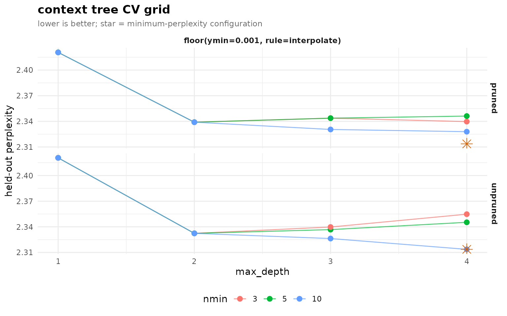
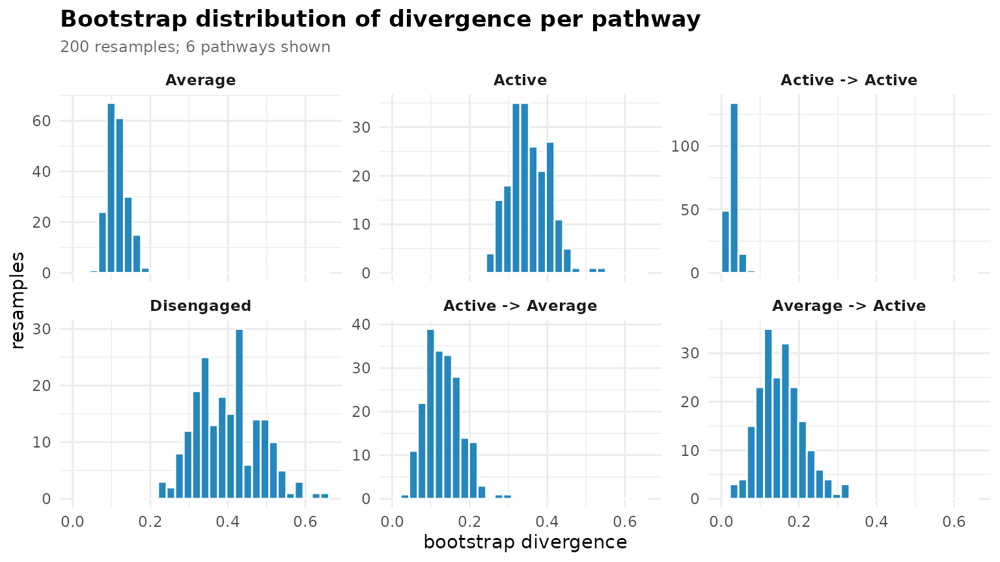

# 4. Advanced analysis: smoothing, tuning, comparison, and mining

This vignette covers the parts of `transitiontrees` beyond the basic
fit-prune-predict loop: choosing a smoother and a pruning rule, picking
hyperparameters by cross-validation, quantifying pathway reliability,
comparing cohorts with a permutation test, introspecting the fitted
tree, and mining it for contexts and sequences of interest.

## Setup

We work throughout from one fit on the bundled `trajectories` data and
its pruned form – the same starting point as *Getting started*.

``` r

library(transitiontrees)
data(trajectories)
set.seed(1)

tree   <- context_tree(trajectories, max_depth = 4L, min_count = 5L)
pruned <- prune_tree(tree, criterion = "G2", alpha = 0.05)
```

## 1. Smoothing schemes

Smoothing decides what probability an *unseen* next state receives. Five
schemes are implemented (`floor`, `laplace`, `kneser_ney`,
`witten_bell`, `jelinek_mercer`).
[`compare_smoothing()`](https://pak.dynasite.org/transitiontrees/reference/compare_smoothing.md)
refits under each and reports in-sample perplexity in one call.

``` r

compare_smoothing(trajectories, max_depth = 4L, min_count = 5L)
#>        smoothing n_nodes perplexity
#> 1          floor      82   2.157411
#> 2        laplace      82   2.181832
#> 3     kneser_ney      82   2.167730
#> 4    witten_bell      82   2.161948
#> 5 jelinek_mercer      82   2.200473
```

Two things to read. First, `n_nodes` is identical across schemes –
smoothing changes *probabilities*, never *which contexts exist*;
topology is set by `min_count`, not the smoother. Second, do **not**
pick a smoother on in-sample perplexity (it rewards memorisation); the
cross-validation in section 3 is the verdict that counts.

Handed a *fitted* tree,
[`compare_smoothing()`](https://pak.dynasite.org/transitiontrees/reference/compare_smoothing.md)
re-smooths it under every scheme (via
[`smooth_tree()`](https://pak.dynasite.org/transitiontrees/reference/smooth_tree.md),
without re-counting) instead of refitting – a smoothing sweep on the
already-pruned model in one call:

``` r

compare_smoothing(pruned)
#>        smoothing n_nodes perplexity
#> 1          floor      25   2.239207
#> 2        laplace      25   2.243759
#> 3     kneser_ney      25   2.241328
#> 4    witten_bell      25   2.240596
#> 5 jelinek_mercer      25   2.296256
```

## 2. Pruning criteria

[`prune_tree()`](https://pak.dynasite.org/transitiontrees/reference/prune_tree.md)
supports four criteria.
[`compare_pruning()`](https://pak.dynasite.org/transitiontrees/reference/compare_pruning.md)
applies each – holding `alpha`/`threshold` fixed – and reports how hard
each one trims.

``` r

compare_pruning(tree)
#>   criterion n_nodes reduction_pct
#> 1        G2      25          69.5
#> 2        KL      78           4.9
#> 3       AIC      42          48.8
#> 4       BIC      36          56.1
```

`G2` (the likelihood-ratio test) and `AIC` ask “is the extra depth
justified given its sample size?”; `BIC` punishes parameters harder (its
penalty scales with `log n`); `KL` at a lenient absolute `threshold`
keeps almost everything. Use `G2` (or `AIC`) unless you have a specific
reason, and report the reduction – “most grown contexts were
unjustified” is itself a finding.

## 3. Cross-validated tuning

[`tune_tree()`](https://pak.dynasite.org/transitiontrees/reference/tune_tree.md)
runs k-fold CV at the **sequence level** over a grid of
`(max_depth, min_count, smoothing, prune)` and returns a ranked
data.frame with the winner on `attr(., "best")`.

``` r

tg <- tune_tree(trajectories, max_depth = 1L:4L, folds = 5L, seed = 42L)
head(tg, 6)
#> <transitiontrees_tune>  6 configurations
#>  max_depth nmin                           smoothing prune    logLik n_scored
#>          4   10 floor(ymin=0.001, rule=interpolate) FALSE -1568.594     1870
#>          3   10 floor(ymin=0.001, rule=interpolate) FALSE -1578.793     1870
#>          4   10 floor(ymin=0.001, rule=interpolate)  TRUE -1580.100     1870
#>          3   10 floor(ymin=0.001, rule=interpolate)  TRUE -1582.190     1870
#>          2    3 floor(ymin=0.001, rule=interpolate) FALSE -1583.660     1870
#>          2    5 floor(ymin=0.001, rule=interpolate) FALSE -1583.660     1870
#>  perplexity n_nodes_avg folds_failed
#>    2.313636        59.8            0
#>    2.326290        31.2            0
#>    2.327916        23.4            0
#>    2.330519        15.4            0
#>    2.332352        13.0            0
#>    2.332352        13.0            0
#> 
#> best (min perplexity):
#>  max_depth nmin                           smoothing prune    logLik n_scored
#>          4   10 floor(ymin=0.001, rule=interpolate) FALSE -1568.594     1870
#>  perplexity n_nodes_avg folds_failed
#>    2.313636        59.8            0
attr(tg, "best")
#>   max_depth nmin                           smoothing prune    logLik n_scored
#> 1         4   10 floor(ymin=0.001, rule=interpolate) FALSE -1568.594     1870
#>   perplexity n_nodes_avg folds_failed
#> 1   2.313636        59.8            0
```

(`min_count` and `prune` are swept by their defaults; add `smoothing =`
or a wider `min_count =` to grow the grid.)

``` r

plot(tg)
```



The shape of the curve is as informative as the winning point: if
perplexity keeps falling with `max_depth` the process has long memory;
if it flattens early (as engagement data tends to) the useful memory is
short and deeper trees just overfit. Refit at the chosen configuration
on the full data for downstream use.

## 4. Bootstrap pathway reliability

[`bootstrap_pathways()`](https://pak.dynasite.org/transitiontrees/reference/bootstrap_pathways.md)
resamples whole sequences and reports, per pathway, `stability_rate`
(the count reproduces) and `informative_rate` (the G-squared against the
parent reproducibly clears the chi-square bar). Keeping the raw
resamples lets you also see the full distribution of any statistic.

``` r

boot <- bootstrap_pathways(pruned, iter = 200L, stat = "count",
                          seed = 1L, keep_resamples = TRUE)
boot
#> <transitiontrees_bootstrap>  200 resamples
#>   stability  : count in [0.50, 1.50] x observed, p < 0.05
#>   informative: G^2 > qchisq(0.95, df=k-1) = 5.99, threshold 0.80
#>   pathways   : 25 total, 22 stable, 16 informative, 15 both
#> 
#> top pathways (stable + informative first):
#>                                pathway depth count p_stability stability_rate
#>                                Average     1   751       0.005              1
#>                                 Active     1   658       0.005              1
#>                       Active -> Active     2   433       0.005              1
#>                             Disengaged     1   325       0.005              1
#>                      Active -> Average     2   160       0.005              1
#>                      Average -> Active     2   144       0.005              1
#>                  Disengaged -> Average     2   122       0.005              1
#>           Active -> Average -> Average     3    80       0.005              1
#>            Average -> Active -> Active     3    70       0.005              1
#>  Average -> Active -> Active -> Active     4    37       0.005              1
#>  stable informative_rate informative mean_G2 ci_G2_lo ci_G2_hi
#>    TRUE            1.000        TRUE 118.478   75.640  167.234
#>    TRUE            1.000        TRUE 320.221  252.539  400.370
#>    TRUE            0.990        TRUE  17.883    7.760   29.091
#>    TRUE            1.000        TRUE 180.794  112.545  264.322
#>    TRUE            1.000        TRUE  28.771   13.505   44.901
#>    TRUE            1.000        TRUE  30.211   11.246   51.521
#>    TRUE            1.000        TRUE  32.634   14.488   53.156
#>    TRUE            0.875        TRUE  13.152    2.924   26.802
#>    TRUE            0.990        TRUE  24.345    9.173   44.483
#>    TRUE            0.860        TRUE  13.638    2.414   32.937
#> # ... 15 more pathways (use summary(x) for full table)
```

[`summary()`](https://rdrr.io/r/base/summary.html) returns the tidy
per-pathway table, sorted so the trustworthy (stable *and* informative)
pathways come first. Each tracked statistic (`count`,
`next_probability`, `divergence`, `G2`) carries a symmetric
`mean / sd / ci_lo / ci_hi` quartet, so you can report a bootstrap CI
for any pathway statistic rather than a bare point estimate:

``` r

head(summary(boot))
#>             pathway depth count likely_next next_probability divergence
#> 1           Average     1   751     Average        0.6098535 0.11356246
#> 2            Active     1   658      Active        0.6975684 0.34948716
#> 3  Active -> Active     2   433      Active        0.7852194 0.02860157
#> 4        Disengaged     1   325  Disengaged        0.4830769 0.40306556
#> 5 Active -> Average     2   160     Average        0.5187500 0.12282588
#> 6 Average -> Active     2   144      Active        0.5000000 0.14727560
#>   changes_prediction        G2 p_stability stability_rate stable
#> 1              FALSE 118.23068 0.004975124              1   TRUE
#> 2               TRUE 318.79579 0.004975124              1   TRUE
#> 3              FALSE  17.16853 0.004975124              1   TRUE
#> 4               TRUE 181.59944 0.004975124              1   TRUE
#> 5              FALSE  27.24365 0.004975124              1   TRUE
#> 6              FALSE  29.40010 0.004975124              1   TRUE
#>   informative_rate informative flip_consistency mean_count sd_count ci_count_lo
#> 1             1.00        TRUE            0.885    752.070 49.62366      652.95
#> 2             1.00        TRUE            0.885    657.700 55.88071      550.90
#> 3             0.99        TRUE            1.000    433.105 49.77925      347.75
#> 4             1.00        TRUE            0.785    326.365 33.36492      265.00
#> 5             1.00        TRUE            0.950    159.290 13.32115      136.00
#> 6             1.00        TRUE            0.620    143.935 13.10494      121.95
#>   ci_count_hi mean_next_probability sd_next_probability ci_next_probability_lo
#> 1     844.325             0.6074684          0.02383435              0.5602254
#> 2     769.175             0.6970828          0.02745211              0.6442147
#> 3     535.200             0.7840172          0.02690600              0.7281187
#> 4     396.050             0.4872506          0.03622112              0.4314732
#> 5     183.050             0.5208427          0.03928445              0.4550557
#> 6     168.025             0.5250488          0.02598869              0.4843571
#>   ci_next_probability_hi mean_divergence sd_divergence ci_divergence_lo
#> 1              0.6549035      0.11439634    0.02594025       0.07183403
#> 2              0.7533809      0.35344122    0.05055127       0.26995876
#> 3              0.8310155      0.03012959    0.01054014       0.01320413
#> 4              0.5611873      0.39995240    0.08188558       0.26407728
#> 5              0.5894276      0.13121723    0.04498657       0.05884796
#> 6              0.5811224      0.15297707    0.05681028       0.05396748
#>   ci_divergence_hi   mean_G2     sd_G2  ci_G2_lo  ci_G2_hi
#> 1       0.16703707 118.47766 24.209041  75.64028 167.23404
#> 2       0.44497422 320.22058 39.049877 252.53941 400.37042
#> 3       0.05071584  17.88321  5.887328   7.75980  29.09055
#> 4       0.57174185 180.79424 40.744883 112.54453 264.32204
#> 5       0.21775813  28.77083  9.600579  13.50545  44.90087
#> 6       0.26903470  30.21052 10.582009  11.24551  51.52106
```

[`plot_pathway_resamples()`](https://pak.dynasite.org/transitiontrees/reference/plot_pathway_resamples.md)
draws the full resample distribution per pathway. A tight unimodal peak
means the estimate is well-determined; a bimodal or heavy-tailed panel
is the tell that the pathway is *carrier-driven* – a few sequences
account for it, and dropping them in a resample collapses it.

``` r

plot_pathway_resamples(boot, stat = "divergence", top = 6L)
```



## 5. Comparing two cohorts

Name an **external** group column and `context_tree(group = )` fits one
tree per group in a single call, returning a `transitiontrees_group`
that
[`prune_tree()`](https://pak.dynasite.org/transitiontrees/reference/prune_tree.md)
and
[`compare_trees()`](https://pak.dynasite.org/transitiontrees/reference/compare_trees.md)
consume directly – no manual splitting or label-building. We compare
high- and low-achieving students on the bundled `group_regulation_long`
log.

``` r

data(group_regulation_long)
grp <- prune_tree(context_tree(group_regulation_long,
                              actor = "Actor", time = "Time", action = "Action",
                              group = "Achiever", max_depth = 2L, min_count = 10L))
cmp <- compare_trees(grp, iter = 199L, seed = 1L)
cmp
#> <transitiontrees_comparison>  iter = 199
#>   observed distance : 0.0478
#>   null mean         : 0.00368
#>   p-value           : 0.005
#> 
#> top divergent pathways:
#>                pathway count_a count_b divergence_ab divergence_ba
#>   cohesion -> cohesion      40       0         0.473         0.447
#>              synthesis     278     374         0.300         0.311
#>     emotion -> emotion      86       0         0.133         0.251
#>                discuss    2003    1948         0.178         0.204
#>               cohesion     938     757         0.120         0.115
#>  discuss -> coregulate       0     170         0.096         0.080
#>  divergence_sym
#>           0.460
#>           0.305
#>           0.192
#>           0.191
#>           0.117
#>           0.088
```

The printed comparison reports the observed distance (`pdist`, a
count-weighted symmetric-KL between the cohorts’ pathway distributions)
and the `p_value` from permuting the sequence-to-cohort labels. A
significant result says the cohorts generate genuinely different pathway
dynamics, not a relabelling artefact.

``` r

plot(cmp)
```


For the full per-axis decomposition (behavioural vs usage) and a tidy
pairwise `distance_matrix`,
[`compare_groups()`](https://pak.dynasite.org/transitiontrees/reference/compare_groups.md)
consumes the same `group =`-fitted tree – see the *Complete analysis
case* vignette.

## 6. Tree introspection

Three accessors treat the tree as a queryable object.

``` r

query_pathway(pruned, c("Active", "Active"))               # full distribution
#>     Active    Average Disengaged 
#> 0.78521940 0.19399538 0.02078522
query_pathway(pruned, "Disengaged", next_state = "Disengaged")  # one cell
#> [1] 0.4830769
pathway_exists(pruned, "Active -> Disengaged")             # membership (no backoff)
#> [1] TRUE
```

By default an unseen context backs off to its longest matching suffix;
pass `exact = TRUE` to demand the literal node (returns `NA` if it is
not one) – the tool for auditing *which* contexts the tree actually
holds.

``` r

query_pathway(pruned, c("Active", "Average", "Active"), exact = TRUE)
#>     Active    Average Disengaged 
#>         NA         NA         NA
```

[`subtree()`](https://pak.dynasite.org/transitiontrees/reference/subtree.md)
extracts the slice rooted at a context – the same pathway API then runs
on the slice:

``` r

sub <- subtree(pruned, "Active")   # its banner reads "subtree of: Active"
sub
#> <transitiontrees>  7 nodes, depth <= 4, 3 states  [pruned]
#>   alphabet : Active, Average, Disengaged
#>   fit on   : 136 sequences, 1870 observations
#>   smoothing: floor(ymin=0.001, rule=interpolate)   min_count = 5
#>   pruned by: G2   alpha = 0.05
#>   subtree of: Active
head(tree_pathways(sub), 4)
#>                      pathway depth count likely_next next_probability
#> 1                     Active     1   658      Active        0.6975684
#> 2           Active -> Active     2   433      Active        0.7852194
#> 3 Active -> Active -> Active     3   316      Active        0.8354430
#> 4          Average -> Active     2   144      Active        0.5000000
#>   divergence changes_prediction
#> 1         NA                 NA
#> 2 0.02860157              FALSE
#> 3 0.01149187              FALSE
#> 4 0.14727560              FALSE
```

## 7. Mining contexts and sequences

[`mine_contexts()`](https://pak.dynasite.org/transitiontrees/reference/mine_contexts.md)
scans the tree for contexts where a chosen state is unusually likely (or
unlikely):

``` r

mine_contexts(pruned, state = "Disengaged", min_prob = 0.5)
#>                                          pathway depth count      state
#> 1 Disengaged -> Average -> Average -> Disengaged     4    13 Disengaged
#> 2                       Disengaged -> Disengaged     2   139 Disengaged
#>        prob is_modal
#> 1 0.8461538     TRUE
#> 2 0.6762590     TRUE
```

[`mine_sequences()`](https://pak.dynasite.org/transitiontrees/reference/mine_sequences.md)
ranks supplied sequences by how well the model predicts them – the
`surprising` ones are atypical trajectories worth a closer look:

``` r

mine_sequences(pruned, newdata = trajectories, which = "surprising", n = 5L)
#>   sequence_id n_scored   log_lik perplexity
#> 1          33        1 -1.664397   5.282486
#> 2          96        1 -1.664397   5.282486
#> 3          97        1 -1.664397   5.282486
#> 4         101        1 -1.664397   5.282486
#> 5         104        1 -1.664397   5.282486
```

## 8. Imputing gaps

[`impute_sequences()`](https://pak.dynasite.org/transitiontrees/reference/impute_sequences.md)
fills *internal* missing states from the fitted tree – `modal` takes the
most likely state at each gap, `prob` samples from the predicted
distribution:

``` r

gappy <- list(c("Active", "Active", NA, "Disengaged"),
              c("Average", NA, "Average"))
impute_sequences(pruned, gappy, method = "modal")
#> [[1]]
#> [1] "Active"     "Active"     "Active"     "Disengaged"
#> 
#> [[2]]
#> [1] "Average" "Average" "Average"
```

## 9. Generating sequences

Every fitted tree is also a generative model.
[`generate_sequences()`](https://pak.dynasite.org/transitiontrees/reference/generate_sequences.md)
samples by walking the conditional distributions;
[`simulate()`](https://rdrr.io/r/stats/simulate.html) is the R-standard
generic wrapping it with `nsim` and a `seed`.

``` r

generate_sequences(pruned, n = 4L, length = 10L)
#>      [,1]         [,2]         [,3]         [,4]         [,5]        
#> [1,] "Average"    "Active"     "Active"     "Active"     "Active"    
#> [2,] "Active"     "Active"     "Active"     "Active"     "Active"    
#> [3,] "Disengaged" "Disengaged" "Disengaged" "Disengaged" "Disengaged"
#> [4,] "Active"     "Disengaged" "Average"    "Average"    "Average"   
#>      [,6]         [,7]         [,8]         [,9]         [,10]       
#> [1,] "Active"     "Active"     "Average"    "Disengaged" "Active"    
#> [2,] "Average"    "Average"    "Average"    "Average"    "Average"   
#> [3,] "Disengaged" "Disengaged" "Disengaged" "Disengaged" "Disengaged"
#> [4,] "Average"    "Active"     "Average"    "Active"     "Active"
simulate(pruned, nsim = 4L, seed = 42L, length = 10L)
#>      [,1]         [,2]         [,3]         [,4]         [,5]        
#> [1,] "Disengaged" "Average"    "Disengaged" "Active"     "Disengaged"
#> [2,] "Disengaged" "Average"    "Disengaged" "Average"    "Average"   
#> [3,] "Average"    "Active"     "Active"     "Active"     "Active"    
#> [4,] "Disengaged" "Disengaged" "Average"    "Disengaged" "Disengaged"
#>      [,6]         [,7]      [,8]         [,9]         [,10]       
#> [1,] "Average"    "Average" "Average"    "Average"    "Average"   
#> [2,] "Average"    "Average" "Disengaged" "Average"    "Average"   
#> [3,] "Disengaged" "Active"  "Average"    "Average"    "Disengaged"
#> [4,] "Active"     "Average" "Disengaged" "Disengaged" "Disengaged"
```

Generated sequences should look plausibly like the real ones – a sanity
check that the model captured the gross dynamics – and give you a null
behavioural corpus for stress-testing a downstream pipeline.
