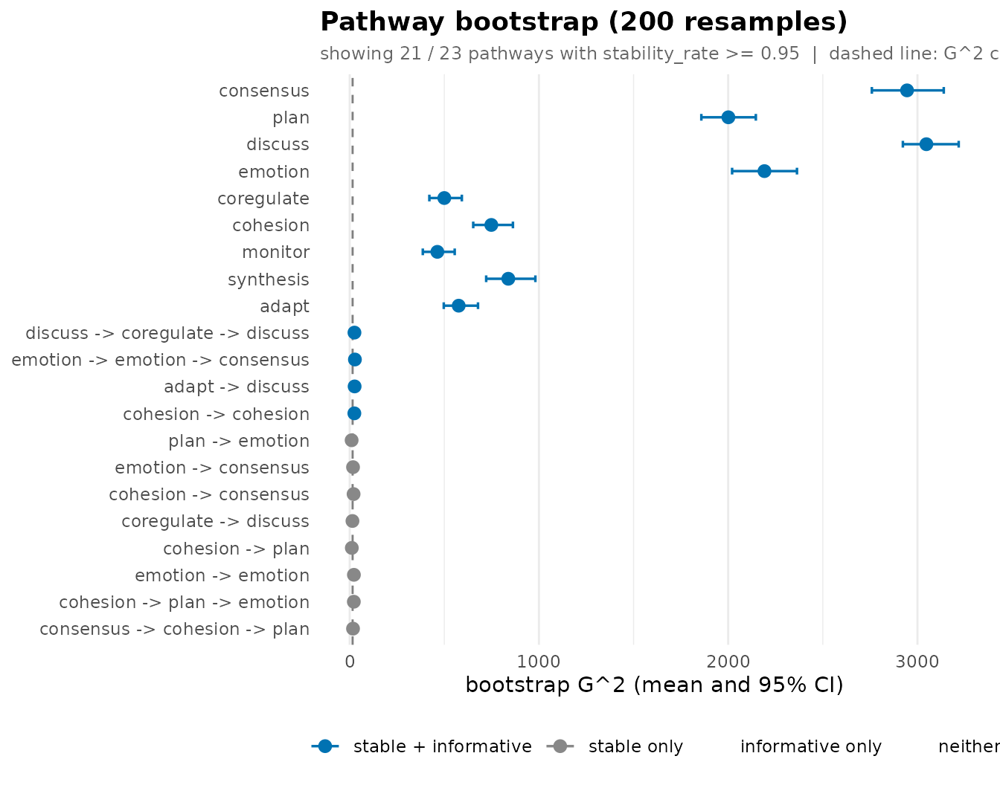
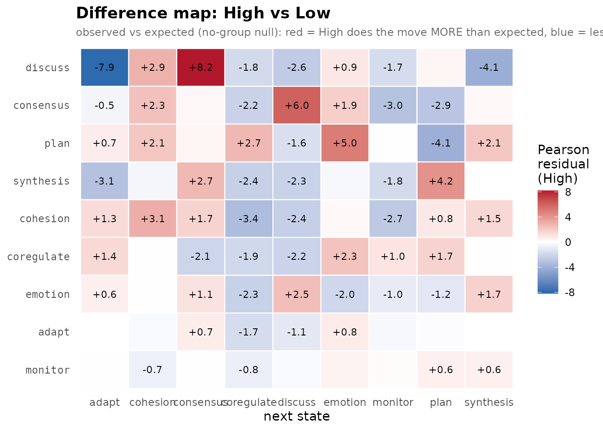

# 2. A complete analysis case: collaborative-regulation sequences

This vignette runs one dataset all the way through and **reads the
numbers at each step** – not just *what* to call but *what the output
means* and *what not to over-read*. The data are the bundled
`group_regulation_long` event log: students’ collaborative
regulation-of-learning actions (`plan`, `monitor`, `consensus`,
`discuss`, …), one row per action, with a `High` / `Low` achievement
label per student.

The arc that emerges, stated up front so the sections connect:
regulation talk has **short memory** – the immediately preceding action
carries most of the predictive signal – a handful of two-action routines
reproducibly add to it, and **high and low achievers regulate
differently**, which the permutation test confirms.

## 1. The data

``` r

data(group_regulation_long)
nrow(group_regulation_long)
#> [1] 27533
head(group_regulation_long)
#>   Actor Achiever Group Course                Time    Action
#> 1     1     High     1      A 2025-01-01 08:27:07  cohesion
#> 2     1     High     1      A 2025-01-01 08:35:20 consensus
#> 3     1     High     1      A 2025-01-01 08:42:18   discuss
#> 4     1     High     1      A 2025-01-01 08:50:00 synthesis
#> 5     1     High     1      A 2025-01-01 08:52:25     adapt
#> 6     1     High     1      A 2025-01-01 08:57:31 consensus
sort(table(group_regulation_long$Action), decreasing = TRUE)
#> 
#>  consensus       plan    discuss    emotion coregulate   cohesion    monitor 
#>       6797       6623       4267       3075       2133       1839       1516 
#>  synthesis      adapt 
#>        729        554
```

The nine actions are very unevenly used: `consensus` and `plan`
dominate, `adapt` and `synthesis` are rare. That imbalance is the most
important fact about the corpus and it echoes through every result – a
model that just guesses `consensus` will look deceptively good, so the
interesting question is never “what is the modal next action” but
“*which histories overturn that default*”.

## 2. Fit

[`context_tree()`](https://pak.dynasite.org/transitiontrees/reference/context_tree.md)
reads the long log directly: name the unit (`actor`), the clock
(`time`), and the state (`action`); it reshapes into one sequence per
session and fits. Sessions are split where the time gap is large.

``` r

tree <- context_tree(group_regulation_long,
                     actor = "Actor", time = "Time", action = "Action",
                     max_depth = 3L, min_count = 10L)
tree
#> <transitiontrees>  377 nodes, depth <= 3, 9 states  [unpruned]
#>   alphabet : adapt, cohesion, consensus, coregulate, discuss, emotion, monitor, plan, synthesis
#>   fit on   : 2000 sequences, 27533 observations
#>   smoothing: floor(ymin=0.001, rule=interpolate)   min_count = 10
#> (start)   n=27533  -> consensus (0.25)
#> |-- adapt     n=509    -> consensus (0.47)
#> |   |-- consensus  n=27     -> cohesion (0.48)
#> |   |-- coregulate  n=28     -> consensus (0.50)
#> |   |   `-- consensus  n=21     -> consensus (0.43)
#> |   |-- discuss   n=259    -> consensus (0.47)
#> |   |   |-- consensus  n=60     -> consensus (0.53)
#> |   |   |-- coregulate  n=37     -> consensus (0.43)
#> |   |   |-- discuss   n=48     -> consensus (0.52)
#> |   |   |-- emotion   n=14     -> consensus (0.50)
#> |   |   |-- monitor   n=25     -> consensus (0.40)
#> |   |   `-- plan      n=26     -> consensus (0.42)
#> |   |-- monitor   n=16     -> consensus (0.50)
#> |   `-- synthesis  n=140    -> consensus (0.48)
#> |       `-- discuss   n=107    -> consensus (0.45)
#> |-- cohesion  n=1695   -> consensus (0.50)
#> |   |-- adapt     n=130    -> consensus (0.54)
#> |   |   |-- consensus  n=13     -> consensus (0.61)
#> |   |   |-- discuss   n=65     -> consensus (0.55)
#> |   |   `-- synthesis  n=32     -> consensus (0.56)
#> |   |-- cohesion  n=45     -> consensus (0.42)
#> |   |   `-- emotion   n=24     -> consensus (0.46)
#> |   |-- consensus  n=84     -> consensus (0.51)
#> |   |   |-- cohesion  n=11     -> plan (0.45)
#> |   |   |-- discuss   n=13     -> consensus (0.61)
#> |   |   |-- emotion   n=11     -> consensus (0.45) 
#> ... 351 more nodes (use as.data.frame(x) or summary(x))
```

The banner reports the depth, the node count, the alphabet, and the
sequence/observation totals. The root line is the **null model**: the
next action given *no* history. Every deeper context has to beat that to
earn its place.

## 3. Inspect

``` r

summary(tree)
#> <transitiontrees summary>  377 nodes, depth <= 3, 9 states  [unpruned]
#> 
#>     pathway depth count likely_next next_probability divergence
#>     (start)     0 27533   consensus        0.2468674         NA
#>   consensus     1  6329        plan        0.3957971  0.3340303
#>        plan     1  6157        plan        0.3742082  0.2341431
#>     discuss     1  3951   consensus        0.3211845  0.5556255
#>     emotion     1  2837    cohesion        0.3253437  0.5551452
#>  coregulate     1  1970     discuss        0.2736041  0.1808906
#>    cohesion     1  1695   consensus        0.4979351  0.3149856
#>     monitor     1  1433     discuss        0.3754361  0.2283039
#>   synthesis     1   652   consensus        0.4630613  0.8917924
#>       adapt     1   509   consensus        0.4741100  0.7892874
#>  changes_prediction
#>                  NA
#>                TRUE
#>                TRUE
#>               FALSE
#>                TRUE
#>                TRUE
#>               FALSE
#>                TRUE
#>               FALSE
#>               FALSE
#> # ... 367 more rows (use as.data.frame(tree) for the full table)
model_fit(tree)
#>      logLik   df  nobs      AIC      BIC perplexity
#> 1 -45464.76 3016 27533 96961.51 121762.5   5.213661
```

Perplexity is the readable scalar: the effective number of equally
likely next actions. The uniform baseline is 9 (nine actions, no
knowledge); the fitted tree’s 5.21 says recent history collapses nine
possibilities to about 5.2. Real structure – but this is *in-sample* and
the tree is over-grown, so read it as an optimistic bound. Sections 6
and 7 give the honest figure.

## 4. The pathway tables

Three named verbs each fix a useful sort over the one canonical schema.

``` r

common_pathways(tree, top = 8)      # the highways
#>             pathway depth count likely_next next_probability   divergence
#> 1           (start)     0 27533   consensus        0.2468674           NA
#> 2         consensus     1  6329        plan        0.3957971 0.3340302623
#> 3              plan     1  6157        plan        0.3742082 0.2341431253
#> 4           discuss     1  3951   consensus        0.3211845 0.5556255176
#> 5           emotion     1  2837    cohesion        0.3253437 0.5551452430
#> 6 consensus -> plan     2  2336        plan        0.3754281 0.0006484903
#> 7      plan -> plan     2  2108        plan        0.3757116 0.0004321472
#> 8        coregulate     1  1970     discuss        0.2736041 0.1808905912
#>   changes_prediction
#> 1                 NA
#> 2               TRUE
#> 3               TRUE
#> 4              FALSE
#> 5               TRUE
#> 6              FALSE
#> 7              FALSE
#> 8               TRUE
```

``` r

divergent_pathways(tree, top = 8)   # where adding history changes the prediction most
#>                             pathway depth count likely_next next_probability
#> 1 synthesis -> discuss -> consensus     3    10  coregulate        0.5956000
#> 2     consensus -> cohesion -> plan     3    12        plan        0.8268333
#> 3                         synthesis     1   652   consensus        0.4630613
#> 4    cohesion -> discuss -> emotion     3    10    cohesion        0.4965000
#> 5                             adapt     1   509   consensus        0.4741100
#> 6     monitor -> monitor -> discuss     3    12     discuss        0.2487500
#> 7 cohesion -> cohesion -> consensus     3    19        plan        0.3661053
#> 8  coregulate -> emotion -> monitor     3    13   consensus        0.3821538
#>   divergence changes_prediction
#> 1  0.9397936               TRUE
#> 2  0.9259734              FALSE
#> 3  0.8917924              FALSE
#> 4  0.8716723               TRUE
#> 5  0.7892874              FALSE
#> 6  0.7829439               TRUE
#> 7  0.7560378              FALSE
#> 8  0.7523873               TRUE
```

``` r

sharp_pathways(tree, top = 8)       # the most peaked next-action predictions
#>                             pathway depth count likely_next next_probability
#> 1     consensus -> cohesion -> plan     3    12        plan        0.8268333
#> 2 discuss -> coregulate -> cohesion     3    11   consensus        0.7217273
#> 3  coregulate -> coregulate -> plan     3    14        plan        0.7088571
#> 4   consensus -> adapt -> consensus     3    12        plan        0.6616667
#> 5  cohesion -> discuss -> synthesis     3    12   consensus        0.6616667
#> 6    emotion -> discuss -> cohesion     3    14   consensus        0.6380714
#> 7           discuss -> plan -> plan     3    11   consensus        0.6316364
#> 8   emotion -> emotion -> consensus     3    58        plan        0.6161034
#>   divergence changes_prediction
#> 1  0.9259734              FALSE
#> 2  0.5087962              FALSE
#> 3  0.6616111              FALSE
#> 4  0.3790714              FALSE
#> 5  0.3634509              FALSE
#> 6  0.2248026              FALSE
#> 7  0.5802868               TRUE
#> 8  0.2405929              FALSE
```

Read the divergent table in two layers. The very top rows can have large
`divergence` on a small `count` – a short history seen just over the
`min_count` floor that happened to resolve one way. Those are
small-sample mirages; the bootstrap in section 7 exists to disarm them.
The rows that *also* carry a large `count` are the well-supported
redirections worth quoting.

The sharp table teaches the same caution from the probability side: a
`next_probability` near 1 on a low `count` is a near-empty cell after
smoothing, not a law of behaviour. Sharpness **with** support is a rule;
sharpness without it is noise.

## 5. Per-context diagnostics

[`tree_dependence()`](https://pak.dynasite.org/transitiontrees/reference/tree_dependence.md)
is the information-theoretic decomposition the KL pruning rule
thresholds: per context, how many **bits** of next-action uncertainty
the extra history removes (`entropy_drop`), and whether it flips the
modal prediction.

``` r

tree_dependence(tree, sort_by = "entropy_drop", top = 8)
#>                                pathway depth count divergence  entropy
#> 1        consensus -> cohesion -> plan     3    12  0.9259734 0.885185
#> 2       cohesion -> discuss -> discuss     3    13  0.6501997 1.599492
#> 3    synthesis -> discuss -> consensus     3    10  0.9397936 1.358019
#> 4 coregulate -> synthesis -> consensus     3    14  0.3945507 1.440219
#> 5     coregulate -> coregulate -> plan     3    14  0.6616111 1.347984
#> 6    discuss -> coregulate -> cohesion     3    11  0.5087962 1.160730
#> 7        monitor -> discuss -> monitor     3    13  0.4218380 1.520958
#> 8          monitor -> cohesion -> plan     3    10  0.4461585 1.432416
#>   entropy_before entropy_drop likely_next likely_before changes_prediction
#> 1       2.289429    1.4042437        plan          plan              FALSE
#> 2       2.683111    1.0836194   consensus     consensus              FALSE
#> 3       2.344887    0.9868676  coregulate          plan               TRUE
#> 4       2.383187    0.9429680        plan          plan              FALSE
#> 5       2.276847    0.9288633        plan          plan              FALSE
#> 6       2.067552    0.9068226   consensus     consensus              FALSE
#> 7       2.401484    0.8805256     discuss       discuss              FALSE
#> 8       2.289429    0.8570129   consensus          plan               TRUE
```

A large `entropy_drop` with `changes_prediction = TRUE` is the most
valuable kind of context: it both sharpens *and* redirects. Watch for
**negative** `entropy_drop` – the longer history left the next action
*more* uncertain than its parent; that is the textbook signature of a
context pruning should remove.

## 6. Prune to the reliable tree

``` r

pruned <- prune_tree(tree, criterion = "G2", alpha = 0.05)
pruned
#> <transitiontrees>  23 nodes, depth <= 3, 9 states  [pruned]
#>   alphabet : adapt, cohesion, consensus, coregulate, discuss, emotion, monitor, plan, synthesis
#>   fit on   : 2000 sequences, 27533 observations
#>   smoothing: floor(ymin=0.001, rule=interpolate)   min_count = 10
#>   pruned by: G2   alpha = 0.05
#> (start)   n=27533  -> consensus (0.25)
#> |-- adapt     n=509    -> consensus (0.47)
#> |-- cohesion  n=1695   -> consensus (0.50)
#> |   `-- cohesion  n=45     -> consensus (0.42)
#> |-- consensus  n=6329   -> plan (0.40)
#> |   |-- cohesion  n=795    -> plan (0.38)
#> |   |   `-- cohesion  n=19     -> plan (0.37)
#> |   `-- emotion   n=830    -> plan (0.39)
#> |       `-- emotion   n=58     -> plan (0.62)
#> |-- coregulate  n=1970   -> discuss (0.27)
#> |-- discuss   n=3951   -> consensus (0.32)
#> |   |-- adapt     n=29     -> adapt (0.24)
#> |   `-- coregulate  n=486    -> consensus (0.32)
#> |       `-- discuss   n=88     -> consensus (0.27)
#> |-- emotion   n=2837   -> cohesion (0.33)
#> |   |-- emotion   n=199    -> cohesion (0.35)
#> |   `-- plan      n=831    -> consensus (0.33)
#> |       `-- cohesion  n=33     -> cohesion (0.27)
#> |-- monitor   n=1433   -> discuss (0.38)
#> |-- plan      n=6157   -> plan (0.37)
#> |   `-- cohesion  n=221    -> plan (0.36)
#> |       `-- consensus  n=12     -> plan (0.83)
#> `-- synthesis  n=652    -> consensus (0.46)
```

The pruned banner reports the surviving node count and criterion;
compare it to the unpruned `tree` from section 2. Each removed context
failed a likelihood-ratio G-squared test against its one-shorter parent:
the extra history did not explain enough added variation in the next
action to justify keeping it. That the tree collapses so far is itself a
finding – most of the grown depth was unsupported, and the durable
structure lives near the root.

## 7. Held-out predictive quality

The honest, out-of-sample estimate comes from cross-validation, which
[`tune_tree()`](https://pak.dynasite.org/transitiontrees/reference/tune_tree.md)
runs at the sequence level over a `(max_depth, min_count, ...)` grid –
no hand-made train/test split. The in-sample perplexity is the
optimistic bound; the cross-validated winner is the figure to report.

``` r

model_fit(pruned)$perplexity                       # in-sample (optimistic)
#> [1] 5.427279

tg <- tune_tree(group_regulation_long,
               actor = "Actor", time = "Time", action = "Action",
               max_depth = 1L:3L, min_count = 10L, folds = 5L, seed = 1L)
attr(tg, "best")                                   # cross-validated winner
#>   max_depth nmin                           smoothing prune    logLik n_scored
#> 1         1   10 floor(ymin=0.001, rule=interpolate) FALSE -46738.34    27533
#>   perplexity n_nodes_avg folds_failed
#> 1   5.460492          10            0
```

A cross-validated perplexity close to the in-sample value is the
signature of a well-pruned model that generalises; a large gap would say
*prune harder*.

[`mine_sequences()`](https://pak.dynasite.org/transitiontrees/reference/mine_sequences.md)
then surfaces the sessions the fitted model predicts worst – the
atypical regulation trajectories worth a closer look – and
[`score_positions()`](https://pak.dynasite.org/transitiontrees/reference/score_positions.md)
the individual moves it is most blindsided by:

``` r

wide <- prepare_input(group_regulation_long,
                     actor = "Actor", time = "Time", action = "Action")
mine_sequences(pruned, newdata = wide, which = "surprising", n = 5L)
#>   sequence_id n_scored   log_lik perplexity
#> 1        1559        2 -8.349842   65.03470
#> 2         446        2 -6.908739   31.63833
#> 3        1823        3 -9.619186   24.68993
#> 4        1323        3 -9.542743   24.06875
#> 5        1671        3 -9.140954   21.05177
score_positions(pruned, newdata = wide, worst = 5L)
#>   sequence_id position matched_context observed predicted_prob   log_lik
#> 1          69       22            plan    adapt   0.0009745006 -6.933585
#> 2         235       17            plan    adapt   0.0009745006 -6.933585
#> 3         974       20            plan    adapt   0.0009745006 -6.933585
#> 4        1227        7            plan    adapt   0.0009745006 -6.933585
#> 5        1424        3            plan    adapt   0.0009745006 -6.933585
```

## 8. Bootstrap reliability

[`prune_tree()`](https://pak.dynasite.org/transitiontrees/reference/prune_tree.md)
asked “which contexts pass a criterion *in this dataset*?”. The
bootstrap asks the stricter question – “which pass *reproducibly* under
resampling?” – and reports two flags. **`stable`**: the count
reproduces. **`informative`**: the G-squared against the parent
reproducibly clears the chi-square bar. A claim worth making is
**both**.

``` r

boot <- bootstrap_pathways(pruned, iter = 200L, stat = "count", seed = 1L)
boot
#> <transitiontrees_bootstrap>  200 resamples
#>   stability  : count in [0.50, 1.50] x observed, p < 0.05
#>   informative: G^2 > qchisq(0.95, df=k-1) = 15.51, threshold 0.80
#>   pathways   : 23 total, 22 stable, 14 informative, 13 both
#> 
#> top pathways (stable + informative first):
#>                           pathway depth count p_stability stability_rate stable
#>                         consensus     1  6329       0.005              1   TRUE
#>                              plan     1  6157       0.005              1   TRUE
#>                           discuss     1  3951       0.005              1   TRUE
#>                           emotion     1  2837       0.005              1   TRUE
#>                        coregulate     1  1970       0.005              1   TRUE
#>                          cohesion     1  1695       0.005              1   TRUE
#>                           monitor     1  1433       0.005              1   TRUE
#>                         synthesis     1   652       0.005              1   TRUE
#>                             adapt     1   509       0.005              1   TRUE
#>  discuss -> coregulate -> discuss     3    88       0.005              1   TRUE
#>  informative_rate informative  mean_G2 ci_G2_lo ci_G2_hi
#>              1.00        TRUE 2945.023 2759.031 3139.060
#>              1.00        TRUE 2000.937 1858.122 2146.064
#>              1.00        TRUE 3047.163 2922.933 3217.945
#>              1.00        TRUE 2191.558 2020.714 2363.409
#>              1.00        TRUE  499.947  421.021  592.660
#>              1.00        TRUE  748.394  652.807  862.595
#>              1.00        TRUE  463.252  386.340  554.916
#>              1.00        TRUE  838.135  721.241  981.181
#>              1.00        TRUE  575.970  497.155  678.049
#>              0.94        TRUE   25.259   14.108   39.538
#> # ... 13 more pathways (use summary(x) for full table)
```

``` r

head(summary(boot), 10)
#>                             pathway depth count likely_next next_probability
#> 1                         consensus     1  6329        plan        0.3957971
#> 2                              plan     1  6157        plan        0.3742082
#> 3                           discuss     1  3951   consensus        0.3211845
#> 4                           emotion     1  2837    cohesion        0.3253437
#> 5                        coregulate     1  1970     discuss        0.2736041
#> 6                          cohesion     1  1695   consensus        0.4979351
#> 7                           monitor     1  1433     discuss        0.3754361
#> 8                         synthesis     1   652   consensus        0.4662577
#> 9                             adapt     1   509   consensus        0.4774067
#> 10 discuss -> coregulate -> discuss     3    88   consensus        0.2727273
#>    divergence changes_prediction        G2 p_stability stability_rate stable
#> 1   0.3340303               TRUE 2930.7338 0.004975124              1   TRUE
#> 2   0.2341431               TRUE 1998.5086 0.004975124              1   TRUE
#> 3   0.5556255              FALSE 3043.2993 0.004975124              1   TRUE
#> 4   0.5551452               TRUE 2183.3402 0.004975124              1   TRUE
#> 5   0.1808906               TRUE  494.0122 0.004975124              1   TRUE
#> 6   0.3149856              FALSE  740.1435 0.004975124              1   TRUE
#> 7   0.2283039               TRUE  453.5394 0.004975124              1   TRUE
#> 8   0.9091915              FALSE  821.7854 0.004975124              1   TRUE
#> 9   0.8132687              FALSE  573.8618 0.004975124              1   TRUE
#> 10  0.1663148              FALSE   20.2894 0.004975124              1   TRUE
#>    informative_rate informative flip_consistency mean_count  sd_count
#> 1              1.00        TRUE            0.920   6332.715 100.94595
#> 2              1.00        TRUE            0.920   6154.545 128.68644
#> 3              1.00        TRUE            0.920   3958.510  74.82871
#> 4              1.00        TRUE            0.635   2833.740  61.43675
#> 5              1.00        TRUE            0.990   1970.235  50.86063
#> 6              1.00        TRUE            0.920   1697.625  44.05506
#> 7              1.00        TRUE            1.000   1435.050  39.94616
#> 8              1.00        TRUE            0.920    653.945  25.96387
#> 9              1.00        TRUE            0.920    508.745  21.23499
#> 10             0.94        TRUE            0.795     87.320  10.91344
#>    ci_count_lo ci_count_hi mean_next_probability sd_next_probability
#> 1     6124.575    6542.075             0.3958547         0.006290070
#> 2     5899.125    6410.275             0.3738465         0.006862613
#> 3     3840.975    4109.000             0.3208082         0.007235758
#> 4     2727.950    2957.025             0.3296368         0.006810490
#> 5     1873.925    2072.075             0.2729068         0.010699039
#> 6     1608.925    1775.025             0.4978701         0.011707013
#> 7     1360.975    1516.075             0.3761944         0.012606040
#> 8      609.925     709.175             0.4686046         0.019148014
#> 9      469.950     541.150             0.4770284         0.023094314
#> 10      68.000     108.050             0.2796210         0.040349747
#>    ci_next_probability_lo ci_next_probability_hi mean_divergence sd_divergence
#> 1               0.3813899              0.4070608       0.3354751   0.009883194
#> 2               0.3607875              0.3870520       0.2345561   0.009013845
#> 3               0.3062034              0.3342840       0.5553488   0.013765563
#> 4               0.3178257              0.3452476       0.5579099   0.020526129
#> 5               0.2511473              0.2919913       0.1829999   0.015127767
#> 6               0.4753595              0.5194326       0.3179724   0.020838135
#> 7               0.3542807              0.3994265       0.2328599   0.021152572
#> 8               0.4382504              0.5126009       0.9244891   0.058973775
#> 9               0.4344480              0.5246681       0.8165718   0.048778787
#> 10              0.2125000              0.3626891       0.2100172   0.056914019
#>    ci_divergence_lo ci_divergence_hi    mean_G2     sd_G2   ci_G2_lo   ci_G2_hi
#> 1         0.3146527        0.3518833 2945.02269 95.097359 2759.03102 3139.05998
#> 2         0.2175416        0.2543880 2000.93710 80.374254 1858.12242 2146.06441
#> 3         0.5321175        0.5837965 3047.16310 80.989452 2922.93286 3217.94484
#> 4         0.5219396        0.5993708 2191.55779 90.171397 2020.71427 2363.40858
#> 5         0.1572404        0.2100213  499.94690 44.662399  421.02122  592.65958
#> 6         0.2815670        0.3584219  748.39404 53.704653  652.80669  862.59461
#> 7         0.1936415        0.2726647  463.25194 44.020310  386.34025  554.91616
#> 8         0.8088775        1.0434987  838.13462 63.489164  721.24145  981.18141
#> 9         0.7370305        0.9219820  575.97036 42.832625  497.15525  678.04880
#> 10        0.1213538        0.3440351   25.25887  6.843082   14.10779   39.53764
```

[`summary()`](https://rdrr.io/r/base/summary.html) sorts the trustworthy
(stable *and* informative) pathways first, so the top rows are the
defensible set. The two flags screen different failure modes. `stable`
alone keeps high-count noise pathways; `informative` alone could surface
a low-count borderline pathway whose sample G-squared is high by chance.
Their conjunction is the defensible set.

``` r

plot(boot)
#> `height` was translated to `width`.
```



In the forest plot each bar is a 95% bootstrap interval on G-squared;
the dashed line is the chi-square critical value. A bar entirely to the
right is reproducibly informative; a bar straddling the line is not safe
to claim.

## 9. Do high and low achievers regulate differently?

Fit **one tree per group** in a single call with `group =`, then test
where the groups diverge with a permutation null. The grouping variable
is an *external* student attribute (`Achiever`), not derived from the
actions themselves – otherwise the comparison would be circular.

``` r

grp <- context_tree(group_regulation_long,
                    actor = "Actor", time = "Time", action = "Action",
                    group = "Achiever", max_depth = 2L, min_count = 10L)
cmp <- compare_groups(grp, iter = 199L, seed = 1L)
cmp$omnibus
#>         axis                 statistic    value p_value
#> 1 behavioral count-weighted JSD (bits) 1772.142   0.005
#> 2      usage                   sum G^2 1356.465   0.005
```

The omnibus table reports two axes. **behavioral** is the count-weighted
Jensen-Shannon divergence (bits) between the groups’ next-action
distributions, summed over shared contexts – “given the same history, do
the groups do different things next?”. **usage** is the summed G-squared
homogeneity statistic – “do they reach the same contexts at the same
rates?”. Each `p_value` comes from permuting the group labels.

``` r

plot_difference(grp, depth = 1L)
```



The per-context residual map shows *where* the groups differ: red and
blue cells are the contexts a high achiever and a low achiever resolve
toward different next actions. `depth = 1L` restricts it to the
single-action contexts so the rows stay readable; drop it (or raise it)
to inspect deeper histories.

## Synthesis

Pulling the thread through every section:

1.  **The action alphabet is imbalanced** – frequency is a misleading
    lens and modal predictions are trivially `consensus`/`plan`.
2.  **Memory is short** – pruning collapses the tree to a small set of
    contexts, and held-out perplexity confirms the shallow model
    generalises.
3.  **The insight is in the divergent, well-counted contexts** – not the
    common ones, and not the spectacular low-count tail.
4.  **Only the stable-and-informative pathways are claimable** – the
    bootstrap is the trust filter between an eyeballed table and a
    finding.
5.  **High and low achievers regulate measurably differently** – the
    permutation test licenses the claim that the omnibus statistic is
    real, not a relabelling artefact.

Each claim is anchored to a function whose output you can re-run – the
whole point of a pathway-centric, testable model.
