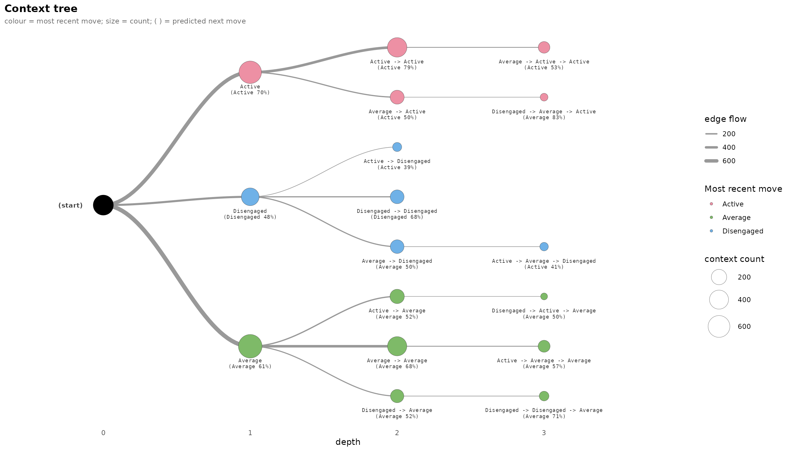

# 1. Getting started: basic analysis and trajectory trees

`transitiontrees` fits a **variable-depth prediction suffix tree** to
categorical sequence data and reports it as a tidy, pathway-centric set
of tables and plots. A fixed-order Markov chain assumes memory is the
*same length everywhere*; a variable-order tree lets the **data decide,
per context, how much history matters**. This first vignette walks the
core workflow end to end and finishes with the two **trajectory trees**
that draw the sequences forward in time.

The other vignettes go further: *Complete analysis case* reads one
dataset all the way through, *Ecosystem compatibility* shows the
`TraMineR` / `tna` / `Nestimate` hand-off, *Advanced analysis* covers
tuning, bootstrapping and comparison, and *Visualization* tours every
plot.

## 1. Fit

[`context_tree()`](https://pak.dynasite.org/transitiontrees/reference/context_tree.md)
accepts a wide character matrix or data.frame, a list of character
vectors, a state-sequence (`stslist`) object, or a long event log. We
start with the bundled `trajectories` matrix (138 learners x 15
time-steps, three engagement states; trailing `NA`s mark dropouts).

``` r

data(trajectories)
dim(trajectories)
#> [1] 138  15

tree <- context_tree(trajectories, max_depth = 3L, min_count = 5L)
tree
#> <transitiontrees>  38 nodes, depth <= 3, 3 states  [unpruned]
#>   alphabet : Active, Average, Disengaged
#>   fit on   : 136 sequences, 1870 observations
#>   smoothing: floor(ymin=0.001, rule=interpolate)   min_count = 5
#> (start)   n=1870   -> Average (0.43)
#> |-- Active    n=658    -> Active (0.70)
#> |   |-- Active    n=433    -> Active (0.79)
#> |   |   |-- Active    n=316    -> Active (0.84)
#> |   |   |-- Average   n=70     -> Active (0.53)
#> |   |   `-- Disengaged  n=15     -> Active (0.67)
#> |   |-- Average   n=144    -> Active (0.50)
#> |   |   |-- Active    n=53     -> Average (0.55)
#> |   |   |-- Average   n=66     -> Active (0.58)
#> |   |   `-- Disengaged  n=12     -> Average (0.83)
#> |   `-- Disengaged  n=29     -> Active (0.52)
#> |       |-- Active    n=6      -> Active (0.83)
#> |       |-- Average   n=13     -> Active (0.54)
#> |       `-- Disengaged  n=9      -> Average (0.56)
#> |-- Average   n=751    -> Average (0.61)
#> |   |-- Active    n=160    -> Average (0.52)
#> |   |   |-- Active    n=74     -> Average (0.55)
#> |   |   |-- Average   n=64     -> Active (0.45)
#> |   |   `-- Disengaged  n=10     -> Average (0.50)
#> |   |-- Average   n=419    -> Average (0.68)
#> |   |   |-- Active    n=80     -> Average (0.57)
#> |   |   |-- Average   n=248    -> Average (0.72)
#> |   |   `-- Disengaged  n=63     -> Average (0.65)
#> |   `-- Disengaged  n=122    -> Average (0.52)
#> |       |-- Active    n=7      -> Disengaged (0.57)
#> |       |-- Average   n=64     -> Disengaged (0.48) 
#> ... 12 more nodes (use as.data.frame(x) or summary(x))
```

`max_depth` caps how long a history (context) may be; `min_count` is the
minimum number of times a context must occur to earn its own node.

A **long event log** is reshaped internally – just name the columns:

``` r

data(group_regulation_long)
head(group_regulation_long)
#>   Actor Achiever Group Course                Time    Action
#> 1     1     High     1      A 2025-01-01 08:27:07  cohesion
#> 2     1     High     1      A 2025-01-01 08:35:20 consensus
#> 3     1     High     1      A 2025-01-01 08:42:18   discuss
#> 4     1     High     1      A 2025-01-01 08:50:00 synthesis
#> 5     1     High     1      A 2025-01-01 08:52:25     adapt
#> 6     1     High     1      A 2025-01-01 08:57:31 consensus
tree_long <- context_tree(group_regulation_long,
                          actor = "Actor", time = "Time", action = "Action",
                          max_depth = 2L, min_count = 5L)
n_nodes(tree_long)
#> [1] 87
```

## 2. Inspect the fit

``` r

summary(tree)
#> <transitiontrees summary>  38 nodes, depth <= 3, 3 states  [unpruned]
#> 
#>                   pathway depth count likely_next next_probability divergence
#>                   (start)     0  1870     Average        0.4347594         NA
#>                   Average     1   751     Average        0.6098535 0.11356246
#>                    Active     1   658      Active        0.6975684 0.34948716
#>                Disengaged     1   325  Disengaged        0.4830769 0.40306556
#>          Active -> Active     2   433      Active        0.7852194 0.02860157
#>        Average -> Average     2   419     Average        0.6778043 0.01466796
#>         Active -> Average     2   160     Average        0.5187500 0.12282588
#>         Average -> Active     2   144      Active        0.5000000 0.14727560
#>  Disengaged -> Disengaged     2   139  Disengaged        0.6762590 0.10977363
#>     Average -> Disengaged     2   134     Average        0.5000000 0.04611817
#>  changes_prediction
#>                  NA
#>               FALSE
#>                TRUE
#>                TRUE
#>               FALSE
#>               FALSE
#>               FALSE
#>               FALSE
#>               FALSE
#>                TRUE
#> # ... 28 more rows (use as.data.frame(tree) for the full table)
model_fit(tree)   # logLik, df, nobs, AIC, BIC, perplexity
#>      logLik df nobs      AIC      BIC perplexity
#> 1 -1511.774 76 1870 3175.548 3596.109   2.244394
```

Perplexity is the effective number of equally likely next states; it
sits below the uniform baseline (the alphabet size, here 3) when history
is informative.

## 3. The pathway tables

Every accessor returns a plain `data.frame` in one canonical schema, so
the views join cleanly. Pathways read left-to-right oldest-to-newest
(`A -> B -> C`); the root context is shown as `(start)`.

- `common_pathways`:Returns the top n pathways by occurrence count – the
  trajectories the data actually contains many copies of.
- `divergent_pathways`: Returns the top n pathways by Kullback-Leibler
  divergence from their (k-1)-suffix. These are the pathways whose
  extended history adds the most predictive information over the shorter
  one. Pathways whose most likely next state actually flips between
  orders are marked in the changes_prediction column.
- `sharp_pathways`: Returns the top n pathways by predictive sharpness –
  the probability mass on their modal next state. High values indicate
  strongly deterministic continuations; low values indicate ambiguous
  next-state distributions.

``` r

common_pathways(tree, top = 6)      # by frequency
#>              pathway depth count likely_next next_probability divergence
#> 1            (start)     0  1870     Average        0.4347594         NA
#> 2            Average     1   751     Average        0.6098535 0.11356246
#> 3             Active     1   658      Active        0.6975684 0.34948716
#> 4   Active -> Active     2   433      Active        0.7852194 0.02860157
#> 5 Average -> Average     2   419     Average        0.6778043 0.01466796
#> 6         Disengaged     1   325  Disengaged        0.4830769 0.40306556
#>   changes_prediction
#> 1                 NA
#> 2              FALSE
#> 3               TRUE
#> 4              FALSE
#> 5              FALSE
#> 6               TRUE
divergent_pathways(tree, top = 6)   # by divergence from the shorter history
#>                           pathway depth count likely_next next_probability
#> 1  Active -> Disengaged -> Active     3     6      Active        0.8318333
#> 2 Disengaged -> Active -> Average     3    10     Average        0.5000000
#> 3                      Disengaged     1   325  Disengaged        0.4830769
#> 4 Disengaged -> Average -> Active     3    12     Average        0.8318333
#> 5                          Active     1   658      Active        0.6975684
#> 6            Active -> Disengaged     2    23      Active        0.3913043
#>   divergence changes_prediction
#> 1  0.6773610              FALSE
#> 2  0.5477701              FALSE
#> 3  0.4030656               TRUE
#> 4  0.3933342               TRUE
#> 5  0.3494872               TRUE
#> 6  0.3478095               TRUE
sharp_pathways(tree, top = 6)       # by how peaked the next-state prediction is
#>                               pathway depth count likely_next next_probability
#> 1          Active -> Active -> Active     3   316      Active        0.8354430
#> 2     Disengaged -> Average -> Active     3    12     Average        0.8318333
#> 3      Active -> Disengaged -> Active     3     6      Active        0.8318333
#> 4                    Active -> Active     2   433      Active        0.7852194
#> 5       Average -> Average -> Average     3   248     Average        0.7177419
#> 6 Disengaged -> Disengaged -> Average     3    31     Average        0.7085484
#>    divergence changes_prediction
#> 1 0.011491875              FALSE
#> 2 0.393334181               TRUE
#> 3 0.677361037              FALSE
#> 4 0.028601567              FALSE
#> 5 0.006242261              FALSE
#> 6 0.198404690              FALSE
```

`changes_prediction = TRUE` flags a context whose single most likely
next state differs from its parent’s – the histories where memory
overturns the corpus-wide default. The lesson the tables teach together:
**common is not the same as informative**. The most frequent pathways
are the backbone of the corpus; the divergent ones carry the insight.

## 4. Prune to the reliable tree

A context can survive fitting yet not earn its depth.
[`prune_tree()`](https://pak.dynasite.org/transitiontrees/reference/prune_tree.md)
collapses contexts whose extra history is not a significant gain over
their parent (default: a likelihood-ratio G-squared test).

``` r

pruned <- prune_tree(tree, criterion = "G2", alpha = 0.05)
pruned
#> <transitiontrees>  18 nodes, depth <= 3, 3 states  [pruned]
#>   alphabet : Active, Average, Disengaged
#>   fit on   : 136 sequences, 1870 observations
#>   smoothing: floor(ymin=0.001, rule=interpolate)   min_count = 5
#>   pruned by: G2   alpha = 0.05
#> (start)   n=1870   -> Average (0.43)
#> |-- Active    n=658    -> Active (0.70)
#> |   |-- Active    n=433    -> Active (0.79)
#> |   |   `-- Average   n=70     -> Active (0.53)
#> |   `-- Average   n=144    -> Active (0.50)
#> |       `-- Disengaged  n=12     -> Average (0.83)
#> |-- Average   n=751    -> Average (0.61)
#> |   |-- Active    n=160    -> Average (0.52)
#> |   |   `-- Disengaged  n=10     -> Average (0.50)
#> |   |-- Average   n=419    -> Average (0.68)
#> |   |   `-- Active    n=80     -> Average (0.57)
#> |   `-- Disengaged  n=122    -> Average (0.52)
#> |       `-- Disengaged  n=31     -> Average (0.71)
#> `-- Disengaged  n=325    -> Disengaged (0.48)
#>     |-- Active    n=23     -> Active (0.39)
#>     |-- Average   n=134    -> Average (0.50)
#>     |   `-- Active    n=17     -> Active (0.41)
#>     `-- Disengaged  n=139    -> Disengaged (0.68)
```

The pruned tree’s banner reports its node count and the criterion used –
compare it to the unpruned `tree` printed in section 1 to see how much
the G-squared test removed.

## 5. Predict

``` r

predict(pruned, c("Active", "Active"), type = "class")          # most likely next
#> [1] "Active"
round(predict(pruned, c("Active", "Active"), type = "prob"), 3) # full distribution
#>     Active    Average Disengaged 
#>      0.785      0.194      0.021
```

When an exact context is missing from the tree, prediction backs off to
the longest matching suffix – the property that makes a *variable*-order
model robust: it never refuses to predict, it just uses as much history
as it has evidence for.

## 6. A first tree plot

Just [`plot()`](https://rdrr.io/r/graphics/plot.default.html) the tree.
The default is a horizontal layout: node size is the context count, the
colour is the most-recent state, and the predicted next state sits under
each node.

``` r

plot(pruned)
```



[`plot()`](https://rdrr.io/r/graphics/plot.default.html) also takes
`style = "dendrogram"`, `"icicle"`, or `"interactive"` for the same tree
in other layouts – the *Visualization* vignette tours all four.

## 7. Trajectory trees: where sequences go, and how predictably

The context tree reads *backwards* – a node is a suffix, the most-recent
state. The same sequences can be drawn *forwards* as a **trajectory
tree**: start at the left, every path is a run of states unfolding in
time. Forward trajectories are most informative on a richer alphabet, so
we switch to the bundled `ai_long` log – one row per AI-prompting move
(eight move types: `Execute`, `Investigate`, `Plan`, …), with a session
id.
[`context_tree()`](https://pak.dynasite.org/transitiontrees/reference/context_tree.md)
reads it directly.

``` r

data(ai_long)
tree_ai   <- context_tree(ai_long, actor = "project", session = "session_id",
                         action = "code", max_depth = 3L, min_count = 10L)
pruned_ai <- prune_tree(tree_ai)
tree_ai
#> <transitiontrees>  161 nodes, depth <= 3, 8 states  [unpruned]
#>   alphabet : Ask, Delegate, Execute, Explain, Investigate, Plan, Repair, Report
#>   fit on   : 428 sequences, 8551 observations
#>   smoothing: floor(ymin=0.001, rule=interpolate)   min_count = 10
#> (start)   n=8551   -> Execute (0.38)
#> |-- Ask       n=91     -> Explain (0.48)
#> |   |-- Execute   n=29     -> Execute (0.45)
#> |   |   `-- Execute   n=13     -> Execute (0.54)
#> |   |-- Investigate  n=17     -> Explain (0.53)
#> |   |-- Plan      n=15     -> Explain (0.40)
#> |   `-- Repair    n=13     -> Explain (0.84)
#> |-- Delegate  n=280    -> Plan (0.62)
#> |   |-- Execute   n=61     -> Plan (0.54)
#> |   |   |-- Execute   n=22     -> Plan (0.50)
#> |   |   |-- Investigate  n=13     -> Plan (0.54)
#> |   |   `-- Plan      n=20     -> Plan (0.60)
#> |   |-- Investigate  n=35     -> Plan (0.57)
#> |   |   |-- Execute   n=11     -> Plan (0.72)
#> |   |   `-- Plan      n=10     -> Plan (0.50)
#> |   |-- Plan      n=68     -> Plan (0.67)
#> |   |   |-- Delegate  n=16     -> Plan (0.62)
#> |   |   |-- Execute   n=11     -> Plan (0.72)
#> |   |   `-- Investigate  n=37     -> Plan (0.67)
#> |   |-- Repair    n=10     -> Execute (0.60)
#> |   `-- Report    n=10     -> Execute (0.40)
#> |-- Execute   n=3090   -> Execute (0.51)
#> |   |-- Ask       n=21     -> Execute (0.57)
#> |   |   `-- Execute   n=11     -> Execute (0.63)
#> |   |-- Delegate  n=46     -> Execute (0.41)
#> |   |   `-- Execute   n=13     -> Execute (0.54) 
#> ... 135 more nodes (use as.data.frame(x) or summary(x))
```

[`plot_trajectories()`](https://pak.dynasite.org/transitiontrees/reference/plot_trajectories.md)
draws the forward prefix tree and colours the one tree two ways. These
plots use `ggforce` (a suggested package), so the chunks are guarded.

### By frequency – how many sequences walk each path

``` r

plot_trajectories(tree_ai, measure = "frequency", min_count = 20L)
```


Node fill and edge width both scale to the number of sessions on each
path, so the thick, dark branches are the prompting routines most
projects actually follow – the corpus’s highways from the opening move
outward.

### By predictability – how confidently the model calls each step

``` r

plot_trajectories(pruned_ai, measure = "predictability", min_count = 20L)
```


Same nodes and edges, but each edge is now coloured by
`P(state | history)` from the model. Reading the two side by side
separates **traffic** from **predictability**: an edge that is wide
(frequency) but pale (predictability) is a *decision point* – many
sessions reach it, but the next move is genuinely open. Those forks are
where behaviour is decided rather than executed.

## Where to go next

| You want to… | See vignette |
|----|----|
| Read one dataset all the way through | *Complete analysis case* |
| Feed in a `TraMineR` / `tna` / `Nestimate` object | *Ecosystem compatibility* |
| Tune, bootstrap, and compare cohorts | *Advanced analysis* |
| Tour every plot style | *Visualization* |
