# 5. Visualization: every plot, and how to read it

`transitiontrees` ships a pure-`ggplot2` visual layer (no JavaScript
dependency in the core) plus two optional richer renderers. Every plot
returns a standard object you can theme, save, or further modify. This
vignette tours them all and reads each one.

A shared convention across the static tree styles: **node size = context
count**, **node fill = the most-recent state of the pathway**, and
**edge thickness = the volume of sequences flowing down that branch**.

## Setup

Every plot below is drawn from the same fitted, pruned tree on the
bundled `trajectories` data (138 learners, three engagement states). We
fit it once here and reuse it throughout.

``` r

library(transitiontrees)
data(trajectories)
set.seed(1)

tree   <- context_tree(trajectories, max_depth = 3L, min_count = 5L)
pruned <- prune_tree(tree, criterion = "G2", alpha = 0.05)
pruned
#> <transitiontrees>  18 nodes, depth <= 3, 3 states  [pruned]
#>   alphabet : Active, Average, Disengaged
#>   fit on   : 136 sequences, 1870 observations
#>   smoothing: floor(ymin=0.001, rule=interpolate)   min_count = 5
#>   pruned by: G2   alpha = 0.05
#> (start)   n=1870   -> Average (0.43)
#> |-- Active    n=658    -> Active (0.70)
#> |   |-- Active    n=433    -> Active (0.79)
#> |   |   `-- Average   n=70     -> Active (0.53)
#> |   `-- Average   n=144    -> Active (0.50)
#> |       `-- Disengaged  n=12     -> Average (0.83)
#> |-- Average   n=751    -> Average (0.61)
#> |   |-- Active    n=160    -> Average (0.52)
#> |   |   `-- Disengaged  n=10     -> Average (0.50)
#> |   |-- Average   n=419    -> Average (0.68)
#> |   |   `-- Active    n=80     -> Average (0.57)
#> |   `-- Disengaged  n=122    -> Average (0.52)
#> |       `-- Disengaged  n=31     -> Average (0.71)
#> `-- Disengaged  n=325    -> Disengaged (0.48)
#>     |-- Active    n=23     -> Active (0.39)
#>     |-- Average   n=134    -> Average (0.50)
#>     |   `-- Active    n=17     -> Active (0.41)
#>     `-- Disengaged  n=139    -> Disengaged (0.68)
```

## 1. The fitted tree, four ways

### Horizontal phylogram (default)

Root on the left, depth rightward; every leaf is labelled with its full
arrow-form pathway and the predicted next state. This is the style for a
paper when you need to cite specific pathways inline.

``` r

plot(pruned, style = "horizontal")
```


`point_size_range` and `edge_size_range` exaggerate or compress the size
dynamic range – useful for slides where the count contrast must read
from the back of the room. The encodings are unchanged; only the scales
differ.

``` r

plot(pruned, style = "horizontal",
     point_size_range = c(3, 12), edge_size_range = c(0.4, 3.5))
```

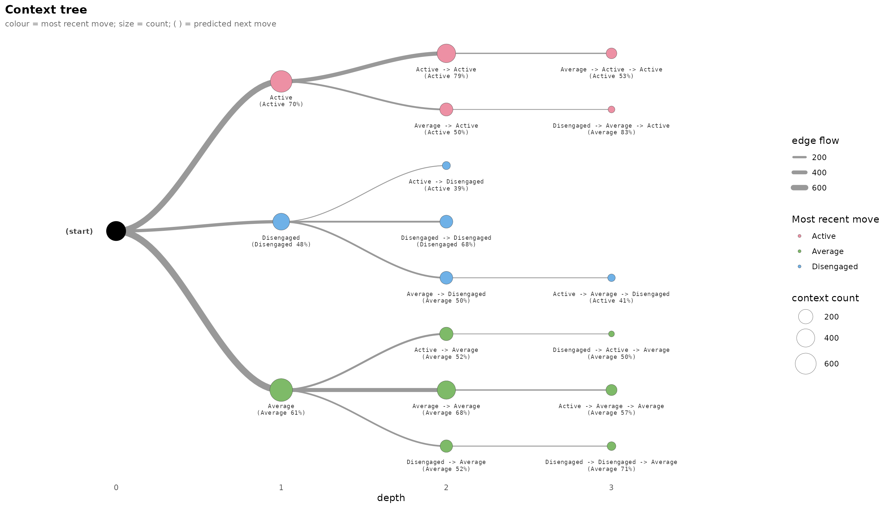

### Radial dendrogram

The same tree wrapped into a circle: the eye goes to the thick central
branches (the corpus highways) versus the thin outer twigs (contexts
pruning kept on evidence, not volume).

``` r

plot(pruned, style = "dendrogram")
```

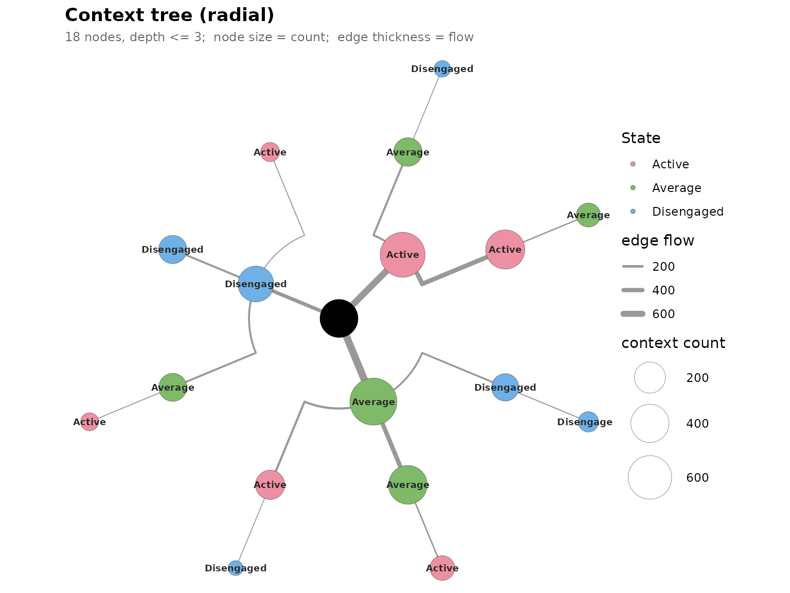

### Icicle / sunburst (needs `ggraph` + `tidygraph`)

A space-filling partition: arc angular width is proportional to count,
so a dominant state visually swallows the ring – an honest depiction of
class imbalance.

``` r

plot(pruned, style = "icicle")
```

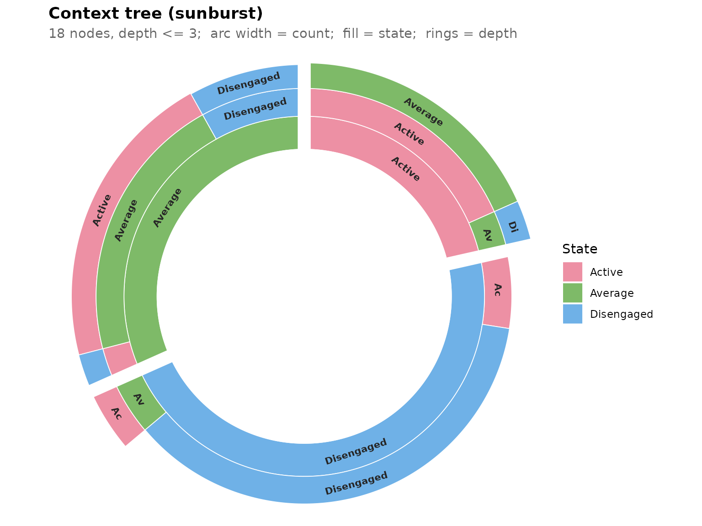

### Interactive collapsible tree (needs `visNetwork`)

A draggable, zoomable widget carrying the same encodings, with a hover
tooltip for each node’s full pathway, count, and distribution. The
exploration tool: collapse the dominant spine and the rare informative
branches become legible.

``` r

plot(pruned, style = "interactive")
```

## 2. Pathway-centric plots

These complement the tree by ranking *pathways* rather than drawing
topology.

### Next-state heatmap

Each row is a context, each column a next state, each cell
`P(next | context)`, modal cell bold; a `>` prefix marks a context whose
modal next state flips versus its shorter parent. Sorting the **same**
data two ways is the single best “common vs informative” figure:

``` r

plot_pathways(pruned, top = 12, sort_by = "count")        # the highways
```

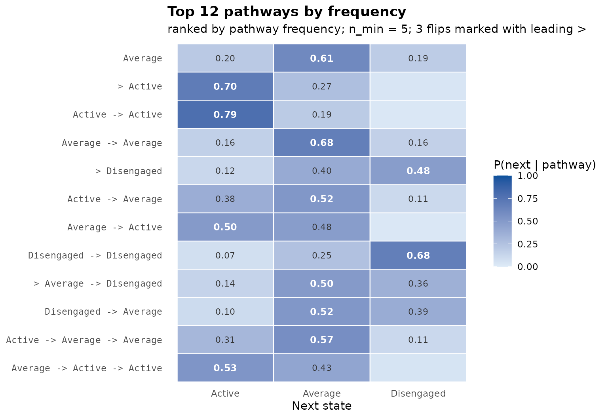

``` r

plot_pathways(pruned, top = 12, sort_by = "divergence")   # the informative ones
```

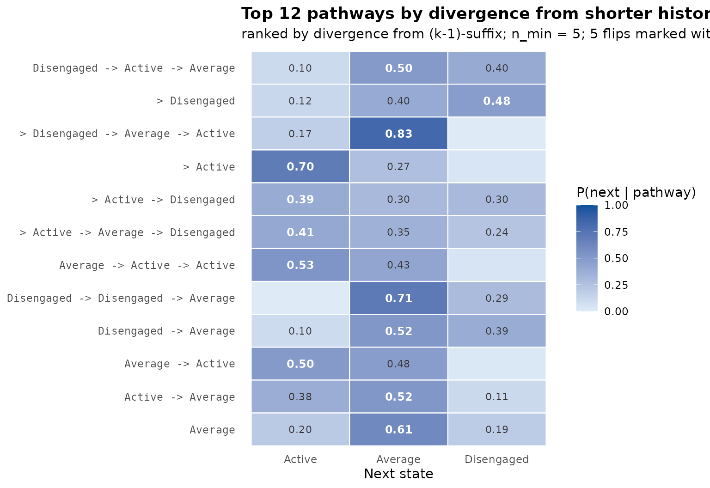

Sorted by count the bright cells stack on the most frequent next state;
sorted by divergence they move off it. That lateral shift is the thesis
in one comparison.

### Divergence lollipop

Per-context KL from the shorter parent, ranked, with orange points
marking modal-flip contexts – the histories that genuinely *change* the
prediction. `min_count` removes small-sample mirages.

``` r

plot_divergence(pruned, top = 12, min_count = 5)
```

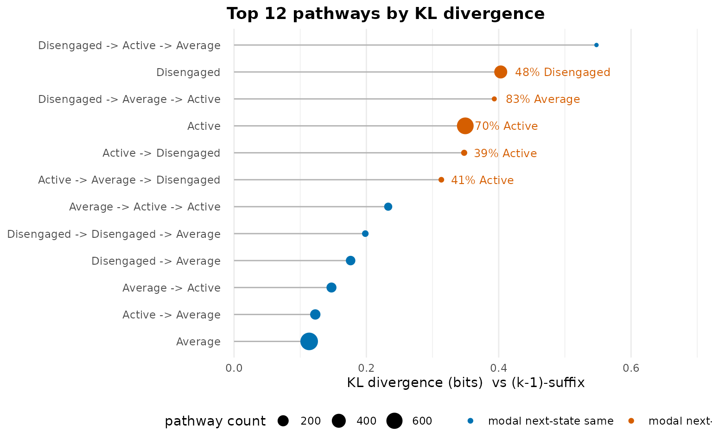

### Per-context distributions

The full next-state distribution for each context as small multiples –
peaked panels are near-settled continuations, flat panels are the
decision points where history does not resolve the next state.

``` r

plot_distributions(pruned, top = 6)
```

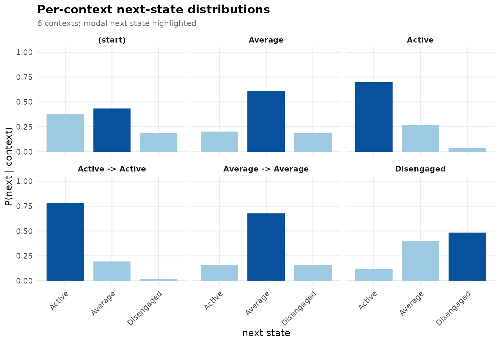

## 3. Diagnostic plots

### How much memory does one pathway need?

[`plot_pruning()`](https://pak.dynasite.org/transitiontrees/reference/plot_pruning.md)
walks a pathway’s suffix chain – the full context, then the same context
with its oldest move dropped, down to the root – and marks which
contexts the pruning test keeps (solid) versus drops (faded). It
answers, for that one pathway, how far back history actually has to
reach.

``` r

plot_pruning(tree, "Active -> Active -> Average")
```

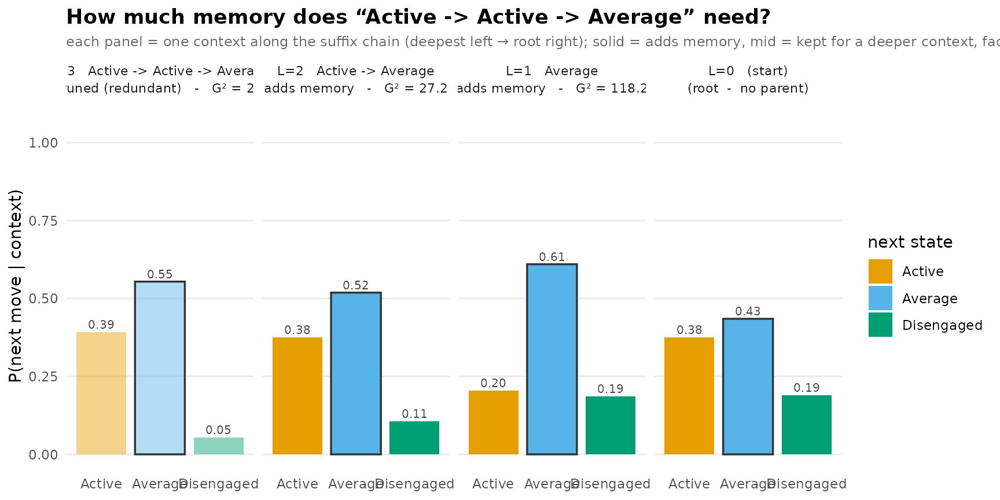

### Predictive quality

[`plot_predictive()`](https://pak.dynasite.org/transitiontrees/reference/plot_predictive.md)
scores sequences against the fitted tree three ways. For this tour we
score the bundled `trajectories` themselves; in a real evaluation pass
genuinely held-out sequences (the *Advanced analysis* vignette shows the
cross-validated route).

`type = "logloss"` – per-position surprise in bits against position;
below the uniform ceiling is structure the model exploited:

``` r

plot_predictive(pruned, trajectories, type = "logloss")
```

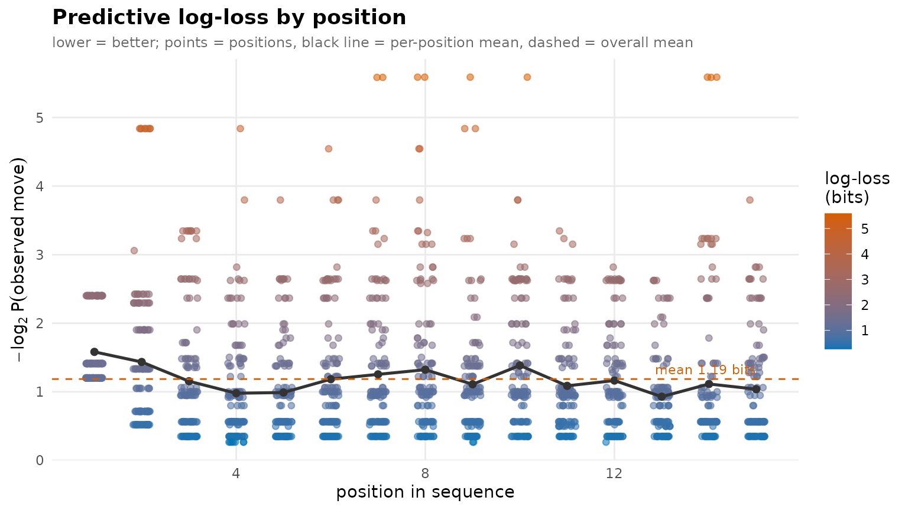

`type = "ecdf"` – the distribution of the probability assigned to the
state that actually occurred; steep steps reveal calibration plateaus
(e.g. a mass of three-way-open branch points):

``` r

plot_predictive(pruned, trajectories, type = "ecdf")
```

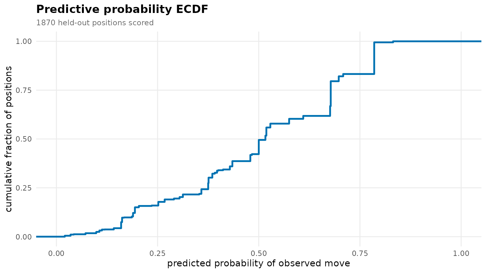

A third type, `type = "position"`, traces each individual sequence’s
confidence move-by-move (one grey line per sequence). It is a
per-sequence view that only reads cleanly for a handful of sequences, so
it is omitted here; reach for it when you want to inspect a few specific
trajectories rather than the corpus as a whole.

## 4. Forward trajectory trees (needs `ggforce`)

The context tree reads backward;
[`plot_trajectories()`](https://pak.dynasite.org/transitiontrees/reference/plot_trajectories.md)
draws the same sequences forward in time. Colour by **frequency** (how
many sequences walk each path) or by **predictability**
(`P(state | history)` from the model). Read together they separate
traffic from predictability – a wide-but-pale edge is a high-traffic
decision point.

Forward trajectories show their structure best on a richer alphabet, so
this section uses the bundled `ai_long` log (eight AI-prompting move
types) rather than the three-state engagement data above.

``` r

data(ai_long)
tree_ai   <- context_tree(ai_long, actor = "project", session = "session_id",
                         action = "code", max_depth = 3L, min_count = 10L)
pruned_ai <- prune_tree(tree_ai)
```

``` r

plot_trajectories(tree_ai, measure = "frequency", min_count = 20L)
```

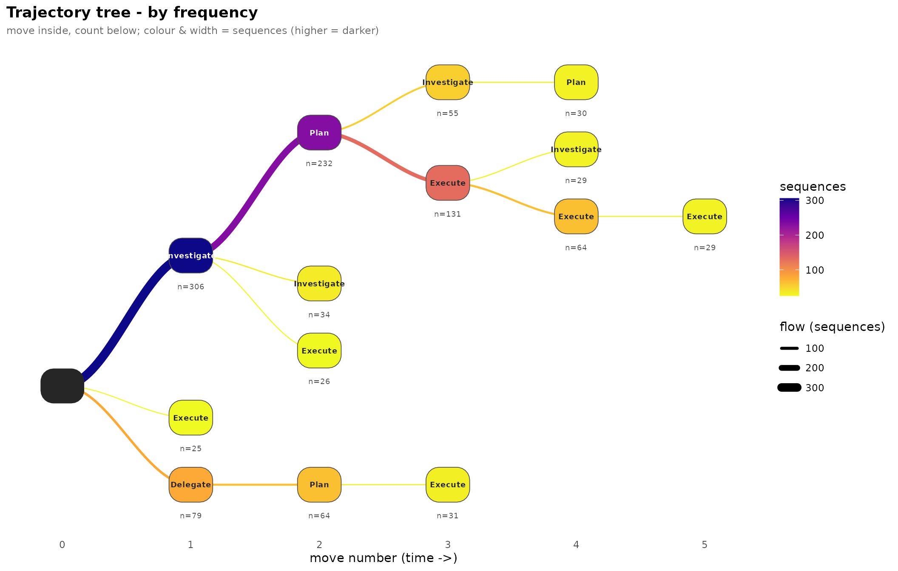

``` r

plot_trajectories(pruned_ai, measure = "predictability", min_count = 20L)
```

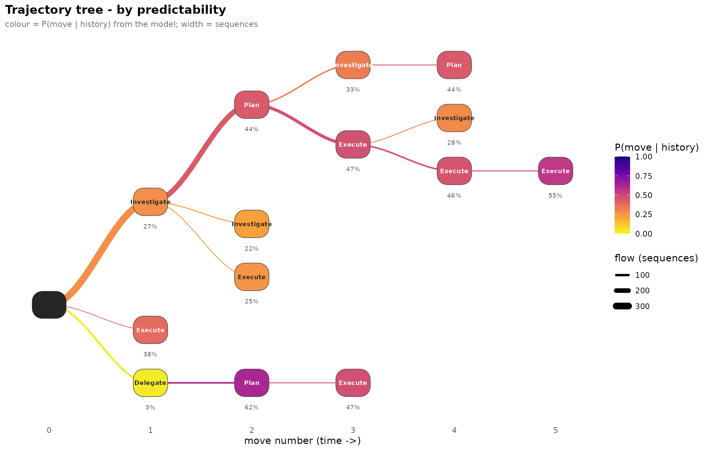

## 5. Inferential plots

### Bootstrap forest plot

Each pathway’s 95% bootstrap interval on G-squared against the
chi-square critical value (dashed line); colour encodes the trust
quadrant. A bar entirely to the right is reproducibly informative.

``` r

boot <- bootstrap_pathways(pruned, iter = 200L, seed = 1L)
plot(boot)
#> `height` was translated to `width`.
```

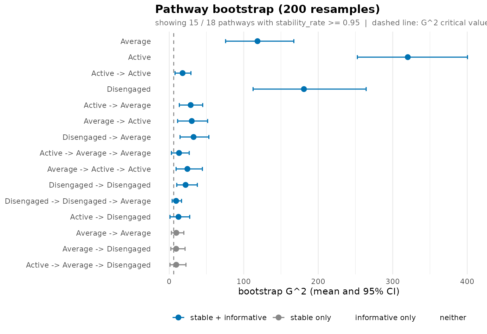

### Per-pathway resample distributions

``` r

plot_pathway_resamples(boot, stat = "divergence", top = 6)
```


### Cohort comparison: permutation null

We name an external group column (`Achiever`) on the bundled
`group_regulation_long` log; `context_tree(group = )` fits one tree per
cohort, and
[`compare_trees()`](https://pak.dynasite.org/transitiontrees/reference/compare_trees.md)
consumes the group directly.

``` r

data(group_regulation_long)
grp_reg <- context_tree(group_regulation_long,
                       actor = "Actor", time = "Time", action = "Action",
                       group = "Achiever", max_depth = 2L, min_count = 10L)
cmp <- compare_trees(prune_tree(grp_reg), iter = 199L, seed = 1L)
plot(cmp)
```

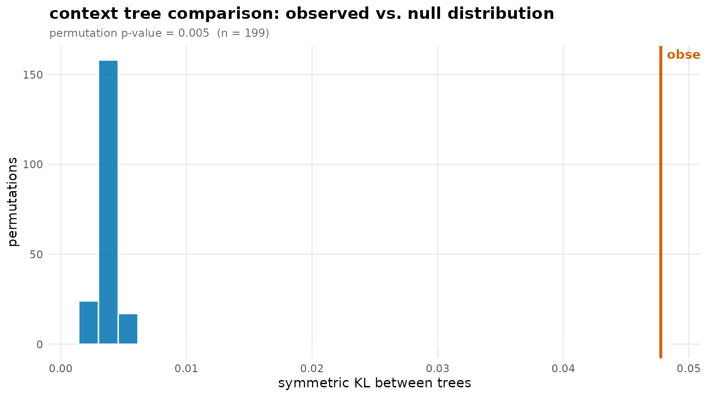

The observed distance (orange line) sits in the right tail of the
label-shuffled null (grey) – the visual form of the permutation p-value.

### Tuning surface

``` r

tg <- tune_tree(trajectories, max_depth = 1L:4L, folds = 5L, seed = 1L)
plot(tg)
```

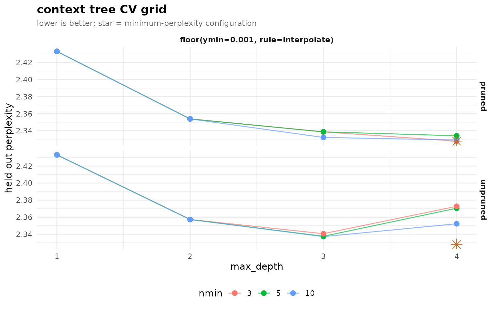

A flat-then-rising perplexity curve is the picture of a short-memory
process; the orange star marks the cross-validated winner.

### Group difference map

[`plot_difference()`](https://pak.dynasite.org/transitiontrees/reference/plot_difference.md)
draws the per-context residual map for the same `group =`-fitted tree –
where two cohorts resolve the same history toward different next states.
`depth = 1L` keeps the map to the single-state contexts so the rows stay
legible (a deep tree has too many contexts to label).

``` r

plot_difference(grp_reg, depth = 1L)
```

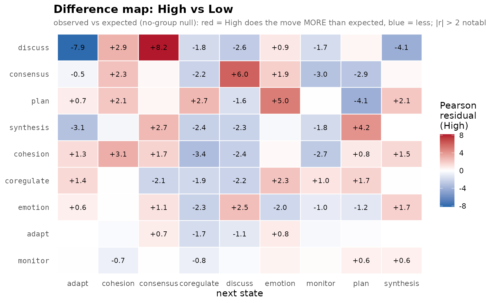

## Recap

| Goal | Function |
|----|----|
| The tree | `plot(style = c("horizontal", "dendrogram", "icicle", "interactive"))` |
| Rank pathways | [`plot_pathways()`](https://pak.dynasite.org/transitiontrees/reference/plot_pathways.md), [`plot_divergence()`](https://pak.dynasite.org/transitiontrees/reference/plot_divergence.md), [`plot_distributions()`](https://pak.dynasite.org/transitiontrees/reference/plot_distributions.md) |
| Memory of one pathway | [`plot_pruning()`](https://pak.dynasite.org/transitiontrees/reference/plot_pruning.md) |
| Held-out quality | `plot_predictive(type = c("logloss", "ecdf", "position"))` |
| Forward trajectories | `plot_trajectories(measure = c("frequency", "predictability"))` |
| Reliability | `plot(<bootstrap>)`, [`plot_pathway_resamples()`](https://pak.dynasite.org/transitiontrees/reference/plot_pathway_resamples.md) |
| Comparison | `plot(<comparison>)`, [`plot_difference()`](https://pak.dynasite.org/transitiontrees/reference/plot_difference.md) |
| Tuning | `plot(<tune>)` |
